# Create-Warlock V4 Specifications

This folder contains user stories and specifications for the **Warlock.js v4** project scaffolding wizard.

## Overview

The `yarn create warlock` command guides users through creating a new Warlock.js project with the following flow:

```mermaid
flowchart TD
    A[Start: yarn create warlock] --> B[Enter Project Name]
    B --> C[Select Database Driver]
    C --> D[Select Features]
    D --> E[Initialize Git?]
    E --> F[Generate JWT Secret?]
    F --> G{User chose JWT?}
    G -->|Yes| H[Install deps + Run JWT command]
    G -->|No| I[Install deps + Run warm-cache]
    H --> J[Done! 🎉]
    I --> J
```

## User Stories Index

| ID                                              | Title                         | Status  |
| ----------------------------------------------- | ----------------------------- | ------- |
| [US-001](./US-001-project-name-input.md)        | Project Name Input            | Planned |
| [US-002](./US-002-database-driver-selection.md) | Database Driver Selection     | Planned |
| [US-003](./US-003-features-selection.md)        | Features Selection            | Planned |
| [US-004](./US-004-git-initialization.md)        | Git Repository Initialization | Planned |
| [US-005](./US-005-jwt-secret-generation.md)     | JWT Secret Generation         | Planned |
| [US-006](./US-006-final-setup.md)               | Final Setup & Installation    | Planned |
| [US-007](./US-007-package-manager-selection.md) | Package Manager Selection     | Planned |

## Technical Notes

- **CLI Library**: Uses `@clack/prompts` for interactive prompts
- **Package Manager**: Auto-detected via `which-pm-runs` (reads from invoking command)
- **Template**: Located in `templates/warlock/` - already v4-ready
- **Features**: Hardcoded deps merged into `package.json` before single install
- **Database Drivers**: MongoDB and PostgreSQL available; MySQL shown as "Coming Soon" (disabled)

## Error Handling Policy

All failures should display the error message and halt the setup process immediately. No automatic cleanup or rollback is performed.
